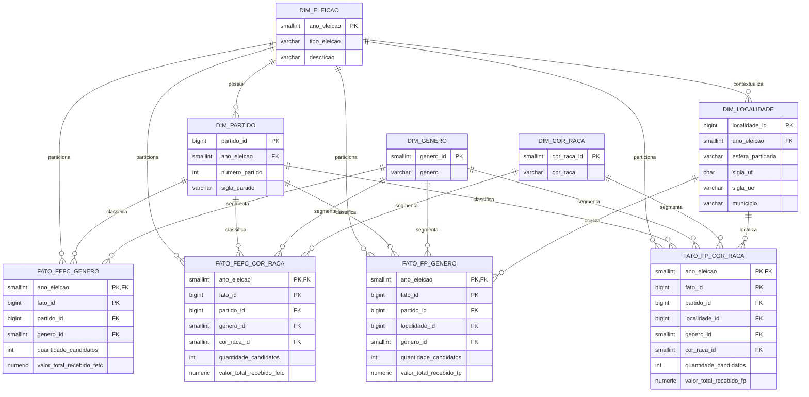

# Modelo Analitico FEFC

O modelo usa quatro tabelas fato para preservar o grao de cada CSV. Cada fato e
uma tabela logica particionada por `ano_eleicao`, com particoes fisicas para
2020, 2022 e 2024.



## Particionamento

Cada tabela fato possui tres particoes `LIST` por ano. Por exemplo:

```text
dw.fato_fp_genero
|-- dw.fato_fp_genero_2020
|-- dw.fato_fp_genero_2022
`-- dw.fato_fp_genero_2024
```

Esse desenho permite consultar todos os anos pela tabela pai e ainda obter
`partition pruning` quando a consulta filtra `ano_eleicao`.
